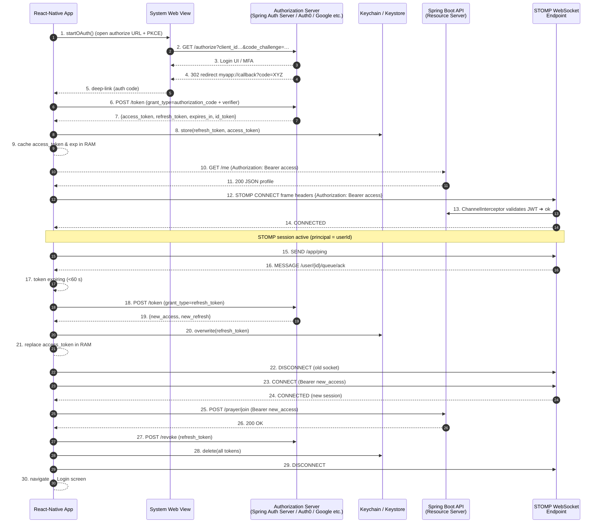

# SalahAtlas - Islamic Prayer and Community Application

SalahAtlas is a comprehensive Islamic application designed to help Muslims connect with their faith and community. The application provides prayer times, qibla direction, community features, and more, all within a secure and user-friendly environment.

## Table of Contents
- [Project Overview](#project-overview)
- [Backend Architecture](#backend-architecture)
  - [Security Implementation](#security-implementation)
  - [DTO Pattern](#dto-pattern)
  - [Email Verification](#email-verification)
  - [Testing Approach](#testing-approach)
  - [WebSocket Implementation](#websocket-implementation)
- [Frontend Implementation](#frontend-implementation)
  - [EAS Expo](#eas-expo)
  - [Push Notifications](#push-notifications)
- [Architecture Principles](#architecture-principles)
- [Key Technical Implementations](#key-technical-implementations)
- [Demo](#demo)
- [Authentication Flow](#authentication-flow)

## Project Overview

SalahAtlas is a full-stack application with a Spring Boot backend and React Native frontend. The application provides:

- User authentication and account management
- Prayer time calculations and notifications
- Qibla compass direction
- Community features
- Email verification for new accounts
- Push notifications for important events

## Backend Architecture

The backend is built with Spring Boot, following a clean, modular architecture that separates concerns and promotes maintainability.

### Security Implementation

The security system is built on Spring Security with JWT (JSON Web Token) authentication:

- **Stateless Authentication**: No server-side sessions, all authentication state is maintained in JWT tokens
- **JWT Tokens**: Access and refresh tokens for secure authentication
- **Role-Based Access Control**: Different access levels based on user roles
- **CORS Configuration**: Secure cross-origin resource sharing
- **Password Encryption**: Secure password storage using bcrypt hashing
- **Rate Limiting**: Protection against brute force attacks

The security flow follows industry best practices:
1. User registers or logs in
2. Server validates credentials and issues JWT tokens
3. Client includes token in Authorization header for subsequent requests
4. Server validates token for each protected endpoint

### DTO Pattern

Data Transfer Objects (DTOs) are used extensively to:

- **Separate Concerns**: Clear distinction between API contracts and internal domain models
- **Input Validation**: Request DTOs validate incoming data
- **Response Shaping**: Response DTOs control what data is exposed to clients
- **Version Control**: Easier API versioning without affecting domain models

The DTO implementation follows a structured approach:
- Request DTOs in `dto/request` packages
- Response DTOs in `dto/response` packages
- Mappers to convert between DTOs and domain entities

### Email Verification

The application implements a secure email verification system:

- New users receive a verification email upon registration
- Verification links include secure tokens with expiration
- Alternative verification code option for mobile users
- Rate limiting to prevent abuse
- Clear error messages for failed verification attempts

### Testing Approach

The backend includes comprehensive testing:

- Unit tests for individual components
- Integration tests for API endpoints
- Security tests to verify authentication and authorization
- Mock services for external dependencies

### WebSocket Implementation

The application features a robust real-time communication system using WebSockets with STOMP (Simple Text Oriented Messaging Protocol):

- **STOMP Protocol**: Provides a standardized way for clients and servers to communicate
- **Secure Authentication**: WebSocket connections are authenticated using JWT tokens
- **Topic-Based Messaging**: Supports both global and targeted messaging channels
- **Real-Time Chat**: Enables instant messaging between users in community features
- **Persistent Storage**: All messages are stored in the database for history and auditing
- **Error Handling**: Comprehensive error handling with automatic reconnection

The WebSocket implementation follows a clean architecture:
1. Backend configuration with Spring's WebSocket support
2. Frontend integration using STOMP.js and SockJS
3. Secure connection management with authentication
4. Automatic reconnection on connection loss

## Frontend Implementation

The frontend is built with React Native and Expo, providing a cross-platform mobile experience.

### EAS Expo

Expo Application Services (EAS) is used for:

- **Build Process**: Streamlined builds for iOS and Android
- **Updates**: Over-the-air updates without app store submissions
- **Configuration**: Centralized configuration management
- **Deployment**: Simplified deployment workflow

The EAS configuration in app.json defines the project settings and build parameters, making it easy to manage the application lifecycle.

### Push Notifications

Push notifications are implemented using Expo's notification system:

- **Token Management**: Registration and storage of Expo push tokens
- **Notification Handling**: Context provider for managing notification state
- **User Permissions**: Proper permission requests and handling
- **Platform Specifics**: Custom channel configuration for Android

The notification system is integrated with the backend to provide timely alerts for:
- Prayer times
- Community events
- Account activities

## Architecture Principles

The project follows several key architecture principles:

- **Loose Coupling**: Components are designed with minimal dependencies
- **Separation of Concerns**: Clear boundaries between different parts of the application
- **RESTful API Design**: Consistent and intuitive API endpoints
- **Security First**: Security considerations at every level of the application
- **Responsive Design**: UI adapts to different screen sizes and orientations
- **Error Handling**: Comprehensive error handling and user feedback

## Key Technical Implementations

The project showcases several advanced technical implementations that demonstrate industry best practices:

### 1. JWT-Based Authentication with Refresh Tokens

The application implements a sophisticated authentication system using JWT (JSON Web Tokens):

- **Stateless Authentication**: No server-side sessions, improving scalability
- **Token Refresh Mechanism**: Secure token refresh without requiring re-authentication
- **Access/Refresh Token Separation**: Short-lived access tokens with longer-lived refresh tokens
- **Secure Storage**: Tokens stored securely in device keychain/keystore
- **Automatic Token Renewal**: Background renewal of tokens before expiration

This implementation provides a balance of security and user experience, following OAuth 2.0 best practices with PKCE for mobile applications.

### 2. Real-Time Communication with WebSockets

The application features a comprehensive real-time messaging system:

- **STOMP over WebSockets**: Industry-standard messaging protocol
- **Authenticated Connections**: WebSocket connections secured with JWT
- **Topic-Based Messaging**: Flexible publish/subscribe architecture
- **Automatic Reconnection**: Resilient connections with intelligent retry logic
- **Optimized for Mobile**: Designed for battery and data efficiency

This implementation enables real-time features like chat, notifications, and live updates without polling the server.

### 3. Multi-Factor Email Verification System

The application implements a secure user verification system:

- **Dual Verification Methods**: Both link and code-based verification options
- **Templated HTML Emails**: Professional email templates using Thymeleaf
- **Token-Based Security**: Time-limited secure tokens for verification
- **Mobile-Friendly Design**: Verification process optimized for mobile devices
- **Rate Limiting**: Protection against abuse and brute force attempts

This implementation ensures user account security while providing a smooth onboarding experience across different devices and contexts.

## Demo - (Video Coming Soon)

  
  
  

  
  
  

  

## Authentication Flow

The following diagram illustrates the OAuth2 + PKCE + STOMP WebSocket authentication flow used in the application:

